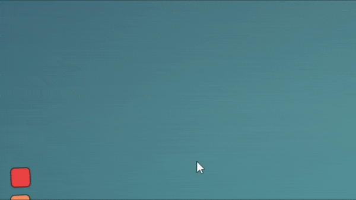

# Townscaper-PlantColor
 
# Installation

1. Download "Melon Loader" by LavaGang:
https://github.com/LavaGang/MelonLoader/releases/latest/

2. Start the MelonLoader.Installer.exe

2.1. Click "Select" and navigate to your Townscaper folder and select the Townscaper.exe (usually: C:\Program Files(x86)\Steam\steamapps\common\Townscaper\Townscaper.exe)

2.2. Untick the "Latest" checkbox and choose version 0.4.3

2.3. Click install 

2.4. During the installation a "Mods" folder gets created it your game folder. MelonLoader does not(!) change any game files. 
	 You can uninstall anytime through the installer or by deleting the "version.dll" file.

3. Download the mod (latest release) by clicking [here](https://github.com/mokojm/Townscaper-PlantColor/releases/download/v0.8.0/PlantsColor.zip)

4. Extract all the files from "PlantsColor.zip" into your games Mods folder.

5. Download the utility mod "ModUI" (latest release) from: https://github.com/DigitalzombieTLD/TownscaperModUI/releases/latest/

6. Extract the all files from the ModUI download into your games Mods folder

7. Start the game !

8. The menu can be found here :

